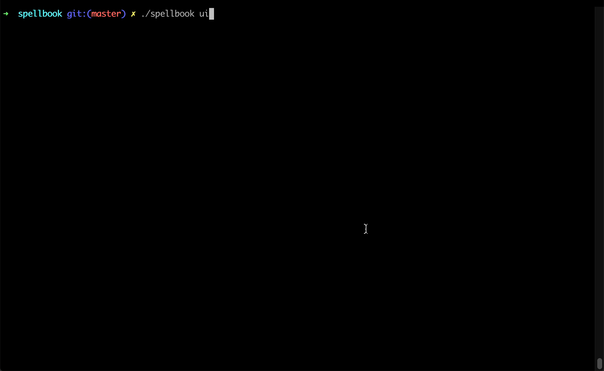

# Spellbook

Spellbook is an in-terminal command-runner, built to help you search through saved commands and to run them.

Instead of using your shell's history file, Spellbook presents a list of commands gathered from `~/.spellbook.yml` and `./.spellbook.yml`, allowing you to have global- and project-specific commands.
This means you maintain the list of commands to save and avoids the issue of multiple shell windows and commands which aren't written to the history file.

Spellbook reduces typing by auto-completing the fixed parts of the command, stopping before each variable. At every point, a preview of what is inserted by the next TAB is shown to the right of the cursor.

Finally, variable input is colored differently - making it easy to distinquish which parts are automatically inserted, and which are manual input.



## Usage

### Adding commands
Create a file, `~/.spellbook.yml` with contents in the following format:
```yml
commands:
    - cmd: dd if=%(input) of=%(out) bs=4M
      desc: write image
    - cmd: ssh-keygen -t rsa -b 4096 -C "%(comment)" -f $HOME/.ssh/%(keyname)
      desc: create SSH key
    - cmd: git log --graph --decorate --oneline
      desc: visualize branches
    - cmd: git stash apply stash@{%(n)}
      desc: apply stash N
    - cmd: uname -a
      desc: print system type
```

These commands are global, meaning they will always be shown by spellbook, no matter which directory you are in.
You can also create a `.spellbook.yml` for commands which should only be shown when in that directory.

**NOTE** Commands may contain variables of the form `%(varname)`. These are used by spellbook to intelligently auto-complete and deleting input.

### TODO

**WIP** Still outstanding changes to be made.

* Remove "HEADER" - possibly show program status and hints
